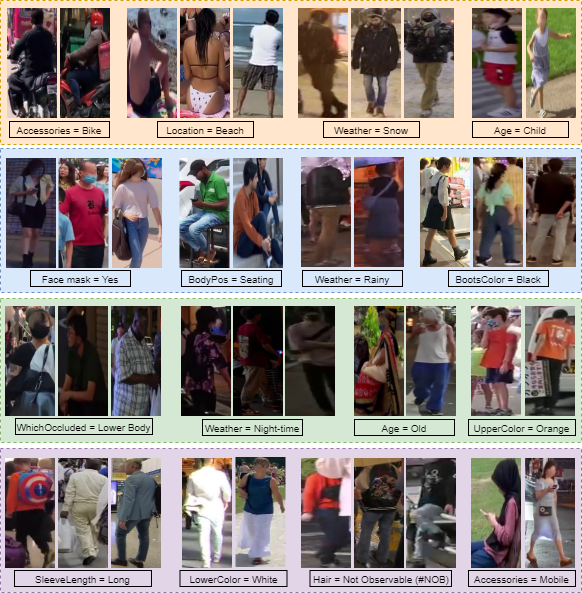

# PEdestrian Attribute Recognition and Learning using 30K images_PEARL_30K
[[Paper]](https://openaccess.thecvf.com/content/WACV2025/papers/Vijay_CLIPping_Imbalances_A_Novel_Evaluation_Baseline_and_PEARL_Dataset_for_WACV_2025_paper.pdf) [[Additional Document]](https://openaccess.thecvf.com/content/WACV2025/supplemental/Vijay_CLIPping_Imbalances_A_WACV_2025_supplemental.pdf) [[Usage Agreement]](https://github.com/draxler1/PEARL30K/blob/main/assests/PEARL%20Usage%20Agreement.pdf) [[Papers With Code]] (https://paperswithcode.com/dataset/pearl30k)

Official repository for "CLIPping Imbalances: A Novel Evaluation Baseline and PEARL Dataset for Pedestrian Attribute Recognition", WACV-25"

## Introduction

The PEARL dataset comprises with 30K pedestrian images, each annotated with 25 attribute categories, spanning over 146 sub-attributes. We have collected images from outdoor surveillance that reflect practical applications and challenges. We comprehensively cover nearly all critical attributes relevant to security surveillance applications, comprising aspects such as body posture, accessories, bag types, clothing styles, colors, and activities. To diversify, we have extracted images from twelve countries that covers seven distinct public locations including streets, parks, airports, stations, college campuses, beaches, and marketplaces. Additionally, we have incorporated four distinct weather conditions: sunny, night-time, rainy, and snow.



Below are attributes covered in PEARL30K:

```python
# Attribute List:
PEARL30K = {
    'Gender': ['Male', 'Female', 'Other', 'NO#'],
    'Age': ['Adult', 'Young', 'Teenager', 'Old', 'NO#'],
    'Hair': ['Short', 'Long', 'Bald', 'NO#'],
    'HColor': ['Black', 'Blonde', 'White', 'NA', 'Other', 'NO#'],
    'SLength': ['Short', 'Long', 'No Sleeve', 'NA', 'NO#'],
    'Viewpoint': ['Front', 'Back', 'Left', 'Right', 'NO#'],
    'IsOccluded': ['No', 'Yes'],
    'Activity': ['Standing', 'Walking', 'Running', 'Seating', 'Cellphoning', 'Cycling', 'Pooling', 'Talking', 'NO#'],
    'BodyPos': ['Standing', 'Seating'],
    'WhichOccluded': ['NA', 'Head-Shoulder', 'Lower-body', 'Upper-Body'],
    'Hat': ['No', 'Yes', 'NO#'],
    'Glasses': ['No', 'Yes', 'NO#'],
    'Bag': ['No', 'Yes', 'NO#'],
    'BagType': ['NA', 'Handbag', 'Backpack', 'Plastic Bag', 'Suitcase', 'Trolly', 'Shoulder-Bag', 'Other', 'NO#'],
    'BodyShape': ['Thin', 'Normal', 'Fat', 'NO#'],
    'Boots': ['Yes', 'No', 'Other', 'NO#'],
    'BootsColor': ['Black', 'White', 'Blue', 'Gray', 'Other', 'NA', 'NO#'],
    'FaceMask': ['No', 'Yes', 'NO#'],
    'Weather': ['Day', 'Night', 'Rain', 'Snow', 'NO#'],
    'Height': ['Normal', 'Short', 'Tall', 'NO#'],
    'Accessories': ['Nothing', 'Cellphone', 'Trolly', 'Umbrella', 'BiCycle', 'Bike', 'Other', 'NO#'],
    'UpperBody': ['T-shirt', 'Shirt', 'Dress', 'Jacket', 'Suit', 'Coat', 'Sweater', 'Formal', 'No Cloth', 'Burqa', 'Saree', 'Other', 'NO#'],
    'UpperColor': ['Black', 'White', 'Blue', 'Red', 'Green', 'Brown', 'Grey', 'Orange', 'Pink', 'Purple', 'Yellow', 'NA', 'Other'],
    'LowerBody': ['Shorts', 'Jeans', 'Pants', 'Skirt', 'Burqa', 'Saree', 'Other', 'NO#'],
    'LowerColor': ['Black', 'White', 'Blue', 'Red', 'Green', 'Brown', 'Grey', 'Orange', 'Pink', 'Purple', 'Yellow', 'NA', 'Other']
}
```

## Sample Inference Script

STEP 1: Please install below requirements:

```bash
$ pip install git+https://github.com/openai/CLIP.git
$ pip install pillow numpy pandas
$ pip install torch
```

STEP 2: Download mini-sample model and set appropriate paths

```python
saved_model = '../saved_models/clip_top3_50_VT32.pt'
image_folder = "../sample images/"
caption_csv = "first_three_annotation.csv"
```

STEP 3: Run the `inference_clip_PEARL.py` script:

```bash
$ python inference_clip_PEARL.py
```

Expected Output:

```python
Selected Image: Sample_76_Sunny_GER_Airport_pedestrian374.jpg
Ground Truth Caption: A photo of a person with Gender Female, Age Young and Hair Long.

Prediction Probabilities:
A photo of a person with Gender Female, Age Young and Hair Long.: 0.9780
A photo of a person with Gender Male, Age Old and Hair NO#.: 0.0221

Predicted Attributes:
  Gender: Female
  Age: Young
  Hair: Long

Ground Truth Attributes:
  Gender: Female
  Age: Young
  Hair: Long
```

# PEARL30K Download Instructions

The PEARL30K dataset is made freely available to the research community. Please download and carefully review `PEARL Usage Agreement.pdf` and send signed version on pearlauthors@gmail.com. We will process your request soon and a private link will be shared to your official email address.

## Author's Disclaimer

PEARL30K is designed to reflect the diversity and complexity of real-world scenarios by incorporating a broad range of visual attributes. The authors are committed to respecting all individual-specific characteristics, including but not limited to gender, ethnicity, and appearance-related traits. This dataset does not contain any personally identifiable information (PII). Only general, everyday attributes such as clothing colors, hairstyles, and similar features are included. No identity-linked data is collected, processed, or shared. We prioritize privacy, fairness, and inclusivity in all aspects of dataset creation and usage. Every effort has been made to ensure that the dataset aligns with ethical standards and supports responsible AI research.

# Reference

If you use our dataset or code, please cite the following paper:

```
@InProceedings{Vijay_2025_WACV,
    author    = {Vijay, Kamalakar and Lohani, Lalit and Nayak, Kamakshya Prasad and Dogra, Debi Prosad and Choi, Heeseung and Jung, Hyungjoo and Kim, Ig-Jae},
    title     = {CLIPping Imbalances: A Novel Evaluation Baseline and PEARL Dataset for Pedestrian Attribute Recognition},
    booktitle = {Proceedings of the Winter Conference on Applications of Computer Vision (WACV)},
    month     = {February},
    year      = {2025},
    pages     = {7102-7111}
}
```

## Acknowledgements

We thank [[OpenAI CLIP]](https://github.com/openai/CLIP/tree/main) for their well-modularized code.
